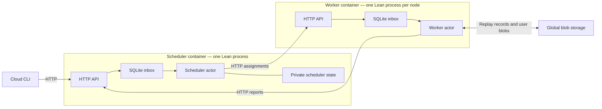

# Local and on-premise deployment

The [console](Console.md) builds your application and starts a persistent pool.
Every node contains the complete registered application. Submitting a workflow
uses that pool; it does not create additional worker or scheduler containers.

```text
cloud> deploy --workers 3
cloud> run sum-squares --id example-1
cloud> top
cloud> ps
cloud> watch example-1
```

There are N + 2 containers: N workers, one scheduler, and shared S3-compatible
blob storage. **Each node runs one Lean process containing its HTTP server,
embedded SQLite inbox, and actor interpreter.** SQLite is a library, not a
separate database service. `scale N` changes worker membership without rebuilding
the image. Pause, resume, and kill affect logical runs rather than containers.



## Responsibilities

The scheduler persists assignments, attempts, dependencies, and confirmed record
keys. It is the sole writer of its coordination database. It does not evaluate
workflow code or assemble branch results. Administrative kill seals the root
cancellation record in blob storage.

Workers reconstruct captured variables from the root program, read recorded
prefixes, and execute commands until a parallel fork or completion. Command
results, joins, and branch returns have immutable blob keys. Once children report
completion, the scheduler makes the parent runnable. A worker reads the ordered
child results and continues.

The inbox service serializes complete SQLite transactions through a mutex. Its
connection is separate from the scheduler's coordination connection. Typed
lean-linq schemas generate table definitions, keys, queries, inserts and deletes.
Both databases explicitly use WAL and `synchronous=FULL`.

## HTTP and configuration

[config.json](../deploy/config.json) contains `mailboxes.scheduler` and
`mailboxes.workers`. Each worker route has a stable `worker` identity and an
`endpoint` containing `host`, `port`, and `token`. HTTP requests use bearer tokens.
The reference configuration is for a trusted local container network.

The CLI publishes only the scheduler's port on an automatically allocated
localhost port and records it in the deployment's `api.json`. Application control
and inspection use HTTP through the CLI's `HostOp.httpPost` effect. Docker still
handles deployment, container inventory, live container metrics, and log collection.
The API runs the same effect-based application protocol as the executable;
remote callers cannot select arbitrary files or executable commands.

Node-to-node communication uses private network aliases. Worker endpoints are
not published to the host. Outgoing HTTP uses a small libcurl C binding; server
and inbox logic are Lean. The HTTP server uses Std's protocol and connection
implementation with an Async accept loop and bounded connection lifetimes.
Connections currently close after each response. API response bodies are bounded
at 16 MiB and request bodies at 8 MiB. Large workflow values belong in blob storage.

`CLOUD_WORKER_ID` selects a configured worker identity. `CLOUD_INBOX_DATABASE`
overrides `/mailbox/inbox.sqlite`. Scheduler state lives at the configured
`scheduler.database`, normally `/data/scheduler.sqlite`. Preserve these volumes,
including SQLite WAL files, across restarts. An exclusive OS lock prevents two
node processes from opening the same inbox volume.

The console generates distinct routes and volumes for any worker count. The
static Compose example has `worker`, `worker2`, and `worker3`; do not duplicate
its fixed identity with `--scale worker=N`. Use the console's `scale N` instead.
Scale-down waits for drain acknowledgements before stopping nodes. Keep retired
worker volumes for rejoining and recovery.

## Delivery and recovery

* A send succeeds only after the receiving SQLite transaction commits.
* Receiving reserves a row. It does not delete it.
* A consumer session permits one outstanding delivery. Its lease is renewed
  while the actor is busy, including during long user computations.
* Acknowledgement checks both the consumer session and delivery receipt before
  deleting the row. Retrying the current acknowledgement is harmless.
* Closing or expiring a session makes its unacknowledged row available again.
  Old sessions cannot acknowledge or disconnect a replacement session.
* Process restart discards volatile reservations, while committed rows survive.
* Losing a send response can cause a duplicate publication. Actor protocols must
  tolerate duplicates; HTTP does not provide exactly-once delivery.

The scheduler saves its state before confirming outgoing messages and
acknowledging input. Workers persist replay records, confirm their reports, and
then acknowledge assignments. Failure between these steps causes retry or
redelivery. Attempt numbers fence reports from superseded assignments.

Busy pool workers also send assignment heartbeats every third of
`scheduler.assignmentMs` (30 seconds by default). This lease is separate from
the inbox consumer lease: long user computations retain their work without
reaching a replay boundary. Only the current run/worker/attempt can renew; pause,
kill, expiry, and scheduler recovery revoke that attempt. Retiring workers keep
renewing until their current assignment finishes. Heartbeats stop when execution
returns or throws; crashed workers stop sending them and their work expires.

A process crash stops both HTTP and the actor. Docker restarts the same node
against its persistent volumes. During downtime, senders cannot obtain acceptance;
failed actor operations restart and recover their unacknowledged inputs. The
pool coordinator can also reconstruct worker replies from saved assignments and
repeated readiness requests. Recovery assumes eventual restarts, restored network
connectivity, and surviving local disks. It does not cover permanent volume loss
or multiple schedulers using different copies of the coordination database.
`docker stop` explicitly terminates the Lean process; unacknowledged work is
recovered from SQLite on restart. Stopping does not drain arbitrary user IO.

`Cloud.exec` can execute again if interrupted before its result is recorded.
Pause/kill are cooperative at record boundaries; in-flight user IO may finish.
Reference workers use 100,000 interpreter steps per assignment; the completion
proof assumes sufficient fuel rather than proving that this default always suffices.

TLS termination, cloud provisioning, and scheduler failover remain future work.
The current local endpoint is HTTP on localhost; do not expose it publicly as-is.
Existing deployments using the old broker format require a fresh deployment:
finish or kill unfinished runs with their original image first, and retain old
volumes for historical data. There is no broker-queue import or automatic schema
migration.

## Checks

```sh
lake test
(cd runtime && lake exe cloud_inbox_tests)
lake exe cloud_console_tests
lake exe cloud_runtime_tests
lake exe cloud_chaos --seed 1 --crashes 8 --workers 3
```

The native inbox suite also runs the application-command and registry unit tests.
It checks real SQLite against the simulator's mailbox model over generated
operation traces, plus session expiry, renewal, duplicate publication,
stale acknowledgements, HTTP authentication, registry access, and committed mail
surviving a SIGKILL. It also checks Pool assignment renewal and revocation using
the real HTTP scheduler and private SQLite. Generated Pool model tests interleave
multiple workflows, restarts, controls, scaling, and delayed worker operations,
then compare durable results with direct evaluation.
Console tests cover the production layout, shared processes,
controls, scaling, generated applications, and node restarts. Component tests run
HTTP inboxes separately to inject transport faults and compare generated cloud
programs with the direct interpreter. These standalone inboxes are test fixtures;
production nodes keep HTTP, SQLite, and their actor in one process.

The existing proofs concern the abstract per-run interpreter and scheduler.
They do not verify SQLite, libcurl, the HTTP stack, or the shared-pool coordinator.
Real adapter tests check those implementations against the abstract contracts.
