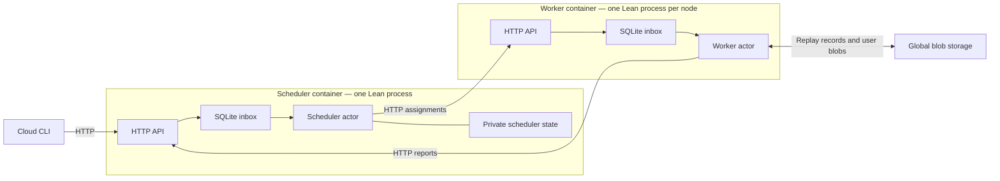

# Local and on-premise deployment

The [console](Console.md) builds your application and starts a persistent pool.
Every node contains the complete registered application. Submitting a workflow
uses that pool; it does not create additional worker or scheduler containers.

```text
cloud> deploy --workers 3
cloud> run sum-squares --id example-1
cloud> top
cloud> ps
cloud> watch example-1
```

There are N + 2 containers: N workers, one scheduler, and shared S3-compatible
blob storage. **Each node runs one Lean process containing its HTTP server,
embedded SQLite inbox, and actor interpreter.** SQLite is a library, not a
separate database service. `scale N` changes worker membership without rebuilding
the image. Pause, resume, and kill affect logical runs rather than containers.



## Responsibilities

The scheduler follows the same recursive structure as `RestartingParallelReplay`:
dispatch a batch, await its replies in assignment order, finish each fork's
children, then resume its parent. In [Scheduler.run](Scheduler/Program.lean),
`spawn` sends work to a worker inbox and `await` suspends until the corresponding
reply arrives. Each workflow has its own in-memory continuation, so waiting does
not block other workflows or administrative commands.

SQLite stores the run catalog, administrative intent, worker membership and
attempt counters. The traversal, pending tickets and branch tree are not saved;
after restart, workers reconstruct progress from their replay records. The
scheduler does not evaluate workflow code or access those records. Administrative
kill stops old attempts before assigning a worker to publish the root cancellation.

Assignments contain only an attempt number and a stable `branchStart`. Workers
reconstruct captured variables from the root program, then replay records in
that branch and execute missing commands until suspension or completion. Command
results, joins, and branch returns have immutable blob keys. Once children report
completion, the scheduler makes the parent runnable. A worker reads the ordered
child results, records their joined outcome, and continues. Storage determines
whether a join is ready; no replay cursor or join flag is sent to the worker.

The inbox service serializes complete SQLite transactions through a mutex. Its
connection is separate from the scheduler's coordination connection. Typed
lean-linq schemas generate table definitions, keys, queries, inserts and deletes.
Both databases explicitly use WAL and `synchronous=FULL`.

Administrative calls use temporary reply inboxes. Closing the call, losing its
consumer lease, or restarting the inbox service retires the reply address and
removes its messages and counter. Late replies cannot recreate it. The scheduler
caches mutating command replies while that address is live, then reclaims them
within its next cleanup pass (once per second while polling). Delayed commands
with retired addresses are acknowledged without executing again. A timeout is
ambiguous: the command may already have committed; inspect the process before
retrying it as a new request. Workflow state, results, replay records, and final
watch views are retained independently of this temporary state.

## HTTP and configuration

[config.json](../deploy/config.json) contains `mailboxes.scheduler` and
`mailboxes.workers`. Each worker route has a stable `worker` identity and an
`endpoint` containing `host`, `port`, and `token`. HTTP requests use bearer tokens.
The reference configuration is for a trusted local container network.

The CLI publishes only the scheduler's port on an automatically allocated
localhost port and records it in the deployment's `api.json`. Application control
and inspection use HTTP through the CLI's `HostOp.httpPost` effect. Docker still
handles deployment, container inventory, live container metrics, and log collection.
The API runs the same effect-based application protocol as the executable;
remote callers cannot select arbitrary files or executable commands.

Node-to-node communication uses private network aliases. Worker endpoints are
not published to the host. Outgoing HTTP uses a small libcurl C binding; server
and inbox logic are Lean. The HTTP server uses Std's protocol and connection
implementation with an Async accept loop and bounded connection lifetimes.
Connections currently close after each response. API response bodies are bounded
at 16 MiB and request bodies at 8 MiB. Large workflow values belong in blob storage.

`CLOUD_WORKER_ID` selects a configured worker identity. `CLOUD_INBOX_DATABASE`
overrides `/mailbox/inbox.sqlite`. Scheduler state lives at the configured
`scheduler.database`, normally `/data/scheduler.sqlite`. Preserve these volumes,
including SQLite WAL files, across restarts. An exclusive OS lock prevents two
node processes from opening the same inbox volume.

The console generates distinct routes and volumes for any worker count. The
static Compose example has `worker`, `worker2`, and `worker3`; do not duplicate
its fixed identity with `--scale worker=N`. Use the console's `scale N` instead.
Scale-down waits for drain acknowledgements before stopping nodes. Keep retired
worker volumes for rejoining and recovery.

## Delivery and recovery

* A send succeeds only after the receiving SQLite transaction commits.
* Receiving reserves a row. It does not delete it.
* A consumer session permits one outstanding delivery. Its lease is renewed
  while the actor is busy, including during long user computations.
* Acknowledgement checks both the consumer session and delivery receipt before
  deleting the row. Retrying the current acknowledgement is harmless.
* Closing or expiring a session makes its unacknowledged row available again.
  Old sessions cannot acknowledge or disconnect a replacement session.
* Process restart discards volatile reservations, while committed rows survive.
* Losing a send response can cause a duplicate publication. Actor protocols must
  tolerate duplicates; HTTP does not provide exactly-once delivery.

The scheduler commits its catalog before confirming outgoing messages and
acknowledging input. Workers persist replay records, confirm their reports, and
then acknowledge assignments. Failure between these steps causes retry or
redelivery. Attempt numbers fence reports from superseded assignments.

A scheduler restart discards its traversal and requests cancellation from all
configured workers. Each serial worker acknowledges only after its current
attempt has returned and its heartbeat task has stopped. Only after every old
owner has stopped may the scheduler dispatch the root again. Pause, kill and
assignment expiry use the same barrier. An expired lease alone never authorizes
an overlapping replacement. An unreachable worker holds up its affected runs
until it reconnects or its process is confirmed stopped through pool retirement.

Busy pool workers also send assignment heartbeats every third of
`scheduler.assignmentMs` (30 seconds by default). This lease is separate from
the inbox consumer lease: long user computations retain their work without
reaching a replay boundary. Only the current run/worker/attempt can renew; pause,
kill, expiry, and scheduler recovery revoke that attempt. Retiring workers keep
renewing until their current assignment finishes. Heartbeats stop when execution
returns or throws; crashed workers stop sending them and their work expires.

A process crash stops both HTTP and the actor. Docker restarts the same node
against its persistent volumes. During downtime, senders cannot obtain acceptance;
unacknowledged inbox deliveries survive. A worker retries storage/transport errors
locally within its current assignment, checking ownership before every replay
record operation. A scheduler restart cancels old owners and reconstructs from
the root, without loading a saved scheduling tree. Recovery assumes eventual
restarts, restored network connectivity, and surviving local disks. It does not cover permanent volume loss
or multiple schedulers using different copies of the coordination database.
`docker stop` explicitly terminates the Lean process; unacknowledged work is
recovered from SQLite on restart. Stopping does not drain arbitrary user IO.

`Cloud.exec` can execute again if interrupted before its result is recorded.
Pause/kill are cooperative at record boundaries; in-flight user IO may finish.
Workers default to 100,000 interpreter steps per attempt. Configure the `worker`
object in your application's `lean-cloud.json`, then redeploy:

```json
"worker": {
  "interpreterFuel": 200000,
  "retryDelayMs": 500,
  "retryMaxDelayMs": 5000
}
```

For the static Compose example, set the same object in `deploy/config.json`.
Applying changed worker limits replaces the compute nodes together, even when
their image is unchanged. Active runs reconstruct from their existing records;
ordinary scaling with unchanged limits keeps the existing nodes.
Old configurations retain defaults. Fuel must be positive. Retry delays must be
positive, ordered, and at most 60 seconds. Infrastructure failures retry locally
with exponential backoff up to the cap, retaining replay records and checking
ownership on the next attempt. They do not consume a permanent retry budget.
Fuel exhaustion is a terminal interpreter error, not an infrastructure retry.
The semantic proofs assume sufficient fuel rather than proving that a particular
configured budget always suffices.

An accepted interpreter error, such as fuel exhaustion or a replay protocol
error, terminates that run. The pool revokes its other attempts and saves the
error in SQLite before a worker publishes a failure in the ordinary immutable root
record. Restart retries an interrupted publication. An existing root result
is preserved; duplicate reports and a later kill cannot replace it. Failed runs
cannot resume: fix the cause and submit a new run.

`CloudProcess.poll`/`await` and the console read that same root outcome.
`result` and `inspect` show the reason; `ps` shows `failed`, and `watch` retains
the last view with the failure reason, including from its offline cache.
Worker crashes and IO/transport exceptions remain retryable and do not create
terminal failure records. Recovery still requires available durable storage.

## Compatibility and upgrades

Version markers are checked at the storage and transport boundaries:

| Boundary | Current version | Older data |
| --- | --- | --- |
| Runtime configuration, deployment/run manifests, scheduler catalog | `formatVersion: 1` | Missing marker means the existing HTTP/SQLite format (version 0). |
| SQLite inbox and scheduler schemas | `cloud_format` row, version 1 | Existing unmarked databases gain a marker without replacing their domain tables. |
| HTTP requests and responses | `protocolVersion: 1` | Unversioned requests and responses remain readable; legacy callers receive the legacy response shape. |
| Backup manifest | `formatVersion: 1` | No older backup format is supported. |

Malformed or newer versions are rejected. SQLite checks happen before domain
schema setup or reply cleanup; protocol checks happen before command execution.
The tagged HTTP result is carried inside a versioned envelope. Worker replay
record formats and `Codec.schema` remain unchanged.

Before a runtime upgrade, finish or kill active workflows, run `down`, and make
a backup. Upgrade the SDK and application together, then `deploy`. Do not replace
the executable for an unfinished workflow: its recorded requests belong to that
program version. Compatibility with version 0 supports adopting existing local
deployments; it is not a promise of arbitrary mixed-version operation or safe
downgrades. Use the saved images and volumes when restoring an earlier deployment.

TLS termination, cloud provisioning, and scheduler failover remain future work.
The current local endpoint is HTTP on localhost; do not expose it publicly as-is.
Existing deployments using the old broker format require a fresh deployment:
finish or kill unfinished runs with their original image first, and retain old
volumes for historical data. There is no broker-queue import or automatic schema
migration. See [backup and restore](Console.md#backup-and-restore) for the supported
stopped-deployment snapshot procedure.

## Checks

```sh
lake test
(cd runtime && lake exe cloud_inbox_tests)
lake exe cloud_console_tests
lake exe cloud_console_tests --chaos-only --seed 1
docker compose run --build --rm checks
```

The native inbox suite also runs the application-command and registry unit tests.
It checks real SQLite against the simulator's mailbox model over generated
operation traces, plus session expiry, renewal, duplicate publication,
stale acknowledgements, HTTP authentication, registry access, and committed mail
surviving a SIGKILL. It also checks Pool assignment renewal and revocation using
the real HTTP scheduler and private SQLite. A two-worker SIGKILL test checks that
only the catalog survives, a missing stop acknowledgement blocks replacement,
late reports are rejected, and root replay returns the direct result. Reply cleanup
tests cover abandoned inboxes, restarts, legacy reply rows, cached errors, and delayed duplicate controls
after cache retirement. Repeated requests return the temporary row and cache
counts to their baseline without removing workflow state. Generated Pool model tests interleave
multiple workflows, restarts, controls, scaling, and delayed worker operations,
then compare durable results with direct evaluation.
Console tests cover the production layout, shared processes,
controls, scaling, generated applications, and node restarts. The pool chaos suite
runs generated pure workflows together on those combined nodes, crashes and
restarts workers and the scheduler, and disconnects nodes and shared blob storage
while work is active. It checks that isolated owners block replacement, late
reports are rejected, and root reconstruction resumes after workers reconnect.
Blob transport failures must remain retryable; records confirmed before the outage
must retain their values after recovery and completion. Durable outcomes must
match direct evaluation. Component tests host separate HTTP inboxes and SQLite
databases in the test process and use a container for S3 storage. They check
durable redelivery and compare generated cloud programs with the direct
interpreter. Production nodes keep HTTP, SQLite, and their actor in one process.

The three semantic proofs compare direct evaluation with sequential replay,
parallel replay, and parallel replay with worker-local restarts over a pure journal.
Scheduler and worker coordination, crashes, recovery, SQLite, libcurl, and HTTP
are covered by model, adapter, and container tests.
