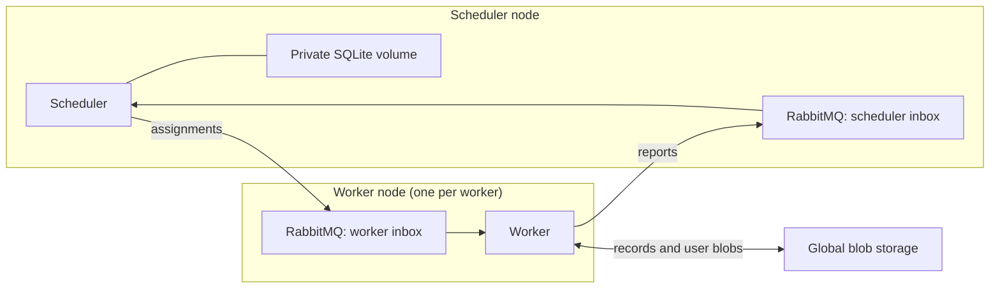

# Local and on-premise deployment

The [console](Console.md) builds your application and starts a persistent node
pool. Every scheduler and worker container contains the complete program registry.

```text
cloud> deploy
cloud> run sum-squares --id example-1
cloud> run log-summary --id example-2
cloud> top
cloud> ps
```

By default there are five containers: one scheduler, three workers, and one S3-compatible
blob service. Each scheduler/worker container runs both its Lean executable and
its own independent RabbitMQ broker. All runs share the deployed pool. Use `deploy --workers N` or live `scale N` in the console; N workers use N + 2 containers.
Submission records the immutable program and input, then publishes a durable registration message.
Workers request assignments; the scheduler routes them across registered runs.

For direct Compose use:

```sh
docker compose up --build -d scheduler worker worker2 worker3
docker compose exec scheduler cloud-app submit /etc/lean-cloud/config.json example-1
docker compose exec scheduler cloud-app result /etc/lean-cloud/config.json example-1
```

`docker compose down` preserves data; `down -v` deletes it. Use the same deployment
configuration and image when restarting unfinished workflows. CLI `pause`,
`resume`, and `kill` affect logical runs and leave the shared containers running.
Pause/kill are cooperative at replay-record boundaries: in-flight IO may finish.

## Responsibilities



The scheduler saves assignments, attempts, child dependencies, and confirmed
record keys. It never evaluates workflow code or assembles results. Administrative kill alone seals the root cancellation record. It is the only writer of
its local database. Typed lean-linq schemas generate its DDL and queries.

Workers reconstruct captured variables from the root program, read recorded
prefixes, and execute commands until a parallel fork or completion.
Each command result, completed join, and branch return has its own immutable
blob key. The scheduler makes the parent runnable after every child has reported
completion. A worker then reads those outcomes, assembles the ordered result,
and continues. Partial joins exist only in scheduler metadata.

## Configuration and transport

[config.json](../deploy/config.json) contains a `mailboxes.scheduler` broker and
a `mailboxes.workers` array mapping stable worker identities to their brokers, the
scheduler's private database path and assignment timeout, and blob credentials.
Workers consume their own broker and publish reports directly to the scheduler's
broker. The scheduler publishes assignments directly to the selected worker's
broker. These are independent brokers: no cluster, federation, or forwarding service.
The scheduler connects to RabbitMQ and owns its local database. Administrative cancellation also uses global blob storage.
Matching worker images must support the submitted
entry point and codecs.

The static Compose example explicitly deploys `worker`, `worker2`, and `worker3`, with identities
`worker1`, `worker2`, and `worker3`. The console generates these identities, routes,
and volumes for any count: use `deploy --workers N` and `scale N` for live changes.
The scheduler stores membership and routing in its local database. Scale-down
waits for generation-tagged drain acknowledgements before stopping nodes; stale
acknowledgements cannot retire workers that have rejoined. Each node keeps a fixed
startup configuration, while membership updates travel through the scheduler mailbox.
Do not use `--scale worker=N`: that would duplicate the same worker identity and
broker instead of creating independent nodes. An unknown or duplicate configured
worker identity is rejected. Broker credentials and ports can differ per node.

Reference workers use a fixed budget of 100,000 interpreter steps per assignment,
including replay of its prefix. Exceeding it reports an interpreter error.
The [completion theorem](Proofs/MainTheorems.lean) requires sufficient fuel for
the program; it does not establish that this default suffices for every workflow.

Each actor has a **durable classic queue**: one for the scheduler and one per
worker. The C FFI uses rabbitmq-c; message types, handlers, scheduling, and workflow
execution are Lean. There is no custom TCP mailbox server or shared work queue.

Publications are persistent, mandatory-routed, and confirmed by the broker.
Consumers use manual acknowledgements and prefetch one. The queues have a single
active consumer, no auto-delete or TTL, and no finite delivery limit that could
discard work during repeated crashes. Duplicate delivery remains possible.
Every broker has a stable hostname and its own persistent volume. A small native
entry point starts RabbitMQ, waits for its listener, then starts Lean as an
unprivileged process. If Lean exits, it restarts inside the same container while
RabbitMQ keeps accepting mail. If RabbitMQ exits, the node stops and Docker
restarts the container. Shutdown stops Lean before RabbitMQ. Health checks cover
both processes. If a destination broker is down, a publication cannot be
confirmed; the sending actor fails and its node entry point restarts it.
Its unacknowledged input remains available for recovery. Retain the broker routes
and volumes until pending deliveries have been handled, including for retired workers.
Recovery assumes failed brokers eventually restart with their data. The deployment
does not tolerate permanent loss of a broker's disk.
Replication requires a separately validated RabbitMQ quorum deployment.

An immediate SIGKILL after creating and confirming a publication to a new quorum
queue on the tested single-node RabbitMQ 4.3 broker lost that queue's message.
An established quorum queue survived the same restart. The reference uses classic
queues and retains the immediate creation/publication/crash test; the quorum
configuration is not currently supported or claimed to meet the mailbox contract.

Set `CLOUD_WORKER_ID` to the stable identity in `mailboxes.workers`. It falls back
to `HOSTNAME` only if that hostname is configured as a worker identity. A replacement
container with the same identity reopens the same queue on the same broker.
Assignment expiry allows another worker to take over abandoned work. Temporary
control/status reply queues live on the scheduler's broker and are deleted after use.

The deployment assumes a trusted private network. TLS, automatic scheduler
failover, provider-specific provisioning, and mailbox retirement automation remain
future work. Azure/AWS deployment adapters must preserve these durable mailbox,
private scheduler storage, and immutable global blob contracts.

### Updating an existing deployment

Restart the console and use `deploy` once to replace the old separate actor and
mailbox containers. Existing unfinished runs must first finish or be killed, as
for any image change. Deployment stops the old actors and brokers before
attaching the mailbox volumes to the combined nodes. RabbitMQ hostnames, mailbox
volumes, scheduler storage, and blob data are preserved. The existing
`*-mailbox` addresses become network aliases of the combined containers.

## Failure and recovery

The scheduler saves an atomic SQLite snapshot, confirms outgoing messages in
RabbitMQ, and only then acknowledges its input. A crash before acknowledgement
causes redelivery; duplicate handling repeats or reconstructs the required reply. A report includes an attempt number; a report
from a superseded assignment cannot advance coordination state. Assignment expiry
makes abandoned work available again. Timers must continue during recovery:
a delayed request from a dead worker may temporarily acquire another assignment.

The scheduler is a single active process. An OS lock prevents two processes from
using the same private volume. Restart loads its previous database and expires
old assignments. Preserve that volume across container restarts; loss of the
volume is outside the current recovery contract. Another node with a separate
volume must not run a second scheduler for the same deployment.

A worker writes global records, confirms its completion report in RabbitMQ, then
acknowledges its assignment. It may crash between
those actions. Its replacement discovers and reuses the records, then reports
progress. Conditional blob creation picks a canonical record if attempts overlap;
workers use the winner. A restarted worker resumes its stable mailbox using a fresh consumer session. The scheduler
tracks confirmed record locations, not instantaneous knowledge of all writes.

`Cloud.exec` may execute again after interruption before its result is recorded.
Its external side effects are not exactly-once. Immutable records prevent accepted
results from being overwritten; they do not roll back external actions.

## Checks

```sh
lake test
lake exe cloud_console_tests
lake exe cloud_runtime_tests
lake exe cloud_chaos --seed 1 --crashes 8 --workers 3
```

Console tests exercise the default five-container deployment and elastic grow/drain/zero/rejoin, unchanged node identities
across submissions, Lean-only and broker crashes, graceful shutdown, mailbox
migration, and generated user applications. Runtime component tests deliberately
use separate brokers in an isolated Compose project to inject transport faults,
including a broker for the fresh worker used after completion. They check SQLite persistence,
durable redelivery on every broker, isolation of identically named queues,
concurrent conditional creation, generated programs over real services, and multiple
worker processes. Each broker is killed independently: its confirmed messages
must survive restart while another broker continues delivering mail.
Chaos injects SIGKILL into workers and the
scheduler, restarts them, and checks the durable result after faults stop. Test
artifacts are retained in a temporary directory; only the test project's
containers and volumes are removed.

## Shared-pool scope

`LeanCloud/Pool.lean` composes one ordinary scheduler state per run. It adds run
routing, round-robin selection, and administrative revocation. The existing
interpreter and scheduler proofs still cover their original per-run model;
they are not a proof of this entire deployment coordinator. Pure transition tests
cover routing, duplicate messages, stale attempts, restart, expiry and controls.
The console integration test exercises the same coordinator with real services,
concurrent workflows, worker/scheduler crashes, and deployment down/up recovery.
The separate single-run actor harness remains for differential and chaos tests
of the original interpreter/backend contracts.
