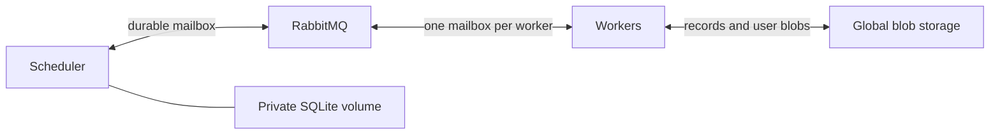

# Local and on-premise deployment

```sh
RUN_ID=example-1 docker compose up --build -d --scale worker=3
docker compose logs -f scheduler worker
docker compose run --rm --no-deps worker result /etc/lean-cloud/config.json example-1
```

This starts one temporary submission container, one scheduler, three workers,
one RabbitMQ broker, and one S3-compatible blob service. Submission stores the immutable program version
and input and seeds the example files. The scheduler's initial state contains the
root assignment. Workers request work through their individual typed mailboxes.
The example produces `files=16, errors=24`.

Use the same `RUN_ID` on subsequent Compose commands that recreate containers.
`docker compose down` preserves data. `down -v` deletes this deployment's data.
A new run id creates a new execution; resubmitting an existing id with different
input is rejected. The initial deployment serves one run per scheduler process.

## Responsibilities



The scheduler saves assignments, attempts, child dependencies, and confirmed
record keys. It never reads or writes replay values. It is the only writer of
its local database. Typed lean-linq schemas generate its DDL and queries.

Workers reconstruct captured variables from the root program, read recorded
prefixes, and execute sequential effects until a parallel fork or completion.
Each sequential result, completed join, and branch return has its own immutable
blob key. The scheduler makes the parent runnable after every child has reported
completion. A worker then reads those outcomes, assembles the ordered result,
and continues. Partial joins exist only in scheduler metadata.

## Configuration and transport

[config.json](../deploy/config.json) contains RabbitMQ connection details, the
scheduler's private database path and assignment timeout, and blob credentials.
Workers connect to RabbitMQ and blobs. The scheduler connects to RabbitMQ and
opens only its local database. Matching worker images must support the submitted
entry point and codecs.

Each actor has a **durable classic queue**: one for the scheduler and one per
worker. The C FFI uses rabbitmq-c; message types, handlers, scheduling, and workflow
execution are Lean. There is no custom TCP mailbox server or shared work queue.

Publications are persistent, mandatory-routed, and confirmed by the broker.
Consumers use manual acknowledgements and prefetch one. The queues have a single
active consumer, no auto-delete or TTL, and no finite delivery limit that could
discard work during repeated crashes. Duplicate delivery remains possible.
The reference deployment uses one broker and a persistent volume. It recovers
after process restart; it does not tolerate loss of that broker's disk.
Replication requires a separately validated RabbitMQ quorum deployment.

An immediate SIGKILL after creating and confirming a publication to a new quorum
queue on the tested single-node RabbitMQ 4.3 broker lost that queue's message.
An established quorum queue survived the same restart. The reference uses classic
queues and retains the immediate creation/publication/crash test; the quorum
configuration is not currently supported or claimed to meet the mailbox contract.

Set `CLOUD_WORKER_ID` to a stable, unique actor address. In containers it defaults
to `HOSTNAME`, which survives a restart of that container. A restarted worker
reopens the same durable mailbox. Replacing a container with a different actor
address leaves the old mailbox for explicit retirement; assignment expiry allows
other workers to take over its work.

The deployment assumes a trusted private network. TLS, automatic scheduler
failover, provider-specific provisioning, and mailbox retirement automation remain
future work. Azure/AWS deployment adapters must preserve these durable mailbox,
private scheduler storage, and immutable global blob contracts.

## Failure and recovery

The scheduler saves an atomic SQLite snapshot, confirms outgoing messages in
RabbitMQ, and only then acknowledges its input. A crash before acknowledgement
causes redelivery; duplicate handling repeats or reconstructs the required reply. A report includes an attempt number; a report
from a superseded assignment cannot advance coordination state. Assignment expiry
makes abandoned work available again. Timers must continue during recovery:
a delayed request from a dead worker may temporarily acquire another assignment.

The scheduler is a single active process. An OS lock prevents two processes from
using the same private volume. Restart loads its previous database and expires
old assignments. Preserve that volume across container restarts; loss of the
volume is outside the current recovery contract. Another node with a separate
volume must not run a second scheduler for the same run.

A worker writes global records, confirms its completion report in RabbitMQ, then
acknowledges its assignment. It may crash between
those actions. Its replacement discovers and reuses the records, then reports
progress. Conditional blob creation picks a canonical record if attempts overlap;
workers use the winner. A restarted worker resumes its stable mailbox using a fresh consumer session. The scheduler
tracks confirmed record locations, not instantaneous knowledge of all writes.

`Cloud.exec` may execute again after interruption before its result is recorded.
Its external side effects are not exactly-once. Immutable records prevent accepted
results from being overwritten; they do not roll back external actions.

## Checks

```sh
lake test
lake exe cloud_runtime_tests
lake exe cloud_chaos --seed 1 --crashes 8 --workers 3
```

Runtime tests use an isolated Compose project. They check SQLite persistence,
durable RabbitMQ redelivery, concurrent conditional creation, generated programs over real services, multiple
worker processes, and service restart. Chaos injects SIGKILL into workers and the
scheduler, restarts them, and checks the durable result after faults stop. Test
artifacts are retained in a temporary directory; only the test project's
containers and volumes are removed.
