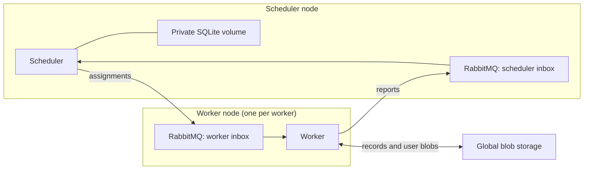

# Local and on-premise deployment

```sh
RUN_ID=example-1 docker compose up --build -d
docker compose logs -f scheduler worker worker2 worker3
docker compose run --rm --no-deps worker result /etc/lean-cloud/config.json example-1
```

This starts one temporary submission container, one scheduler, three workers,
four independent RabbitMQ brokers, and one S3-compatible blob service. Each actor
has its own broker container and persistent volume. Submission stores the immutable program version
and input and seeds the example files. The scheduler's initial state contains the
root assignment. Workers request work through their individual typed mailboxes.
The example produces `files=16, errors=24`.

Use the same `RUN_ID` on subsequent Compose commands that recreate containers.
`docker compose down` preserves data. `down -v` deletes this deployment's data.
A new run id creates a new execution; resubmitting an existing id with different
input is rejected. The initial deployment serves one run per scheduler process.

## Responsibilities



The scheduler saves assignments, attempts, child dependencies, and confirmed
record keys. It never reads or writes replay values. It is the only writer of
its local database. Typed lean-linq schemas generate its DDL and queries.

Workers reconstruct captured variables from the root program, read recorded
prefixes, and execute sequential effects until a parallel fork or completion.
Each sequential result, completed join, and branch return has its own immutable
blob key. The scheduler makes the parent runnable after every child has reported
completion. A worker then reads those outcomes, assembles the ordered result,
and continues. Partial joins exist only in scheduler metadata.

## Configuration and transport

[config.json](../deploy/config.json) contains a `mailboxes.scheduler` broker and
a `mailboxes.workers` array mapping stable worker identities to their brokers, the
scheduler's private database path and assignment timeout, and blob credentials.
Workers consume their own broker and publish reports directly to the scheduler's
broker. The scheduler publishes assignments directly to the selected worker's
broker. These are independent brokers: no cluster, federation, or forwarding service.
The scheduler connects to RabbitMQ and opens only its local database.
Matching worker images must support the submitted
entry point and codecs.

The example explicitly deploys `worker`, `worker2`, and `worker3`, with identities
`worker1`, `worker2`, and `worker3`. To add a worker, add its broker and persistent
volume, add its route in `mailboxes.workers`, and set its `CLOUD_WORKER_ID`.
Do not use `--scale worker=N`: that would duplicate the same worker identity and
broker instead of creating independent nodes. An unknown or duplicate configured
worker identity is rejected. Broker credentials and ports can differ per node.

Reference workers use a fixed budget of 100,000 interpreter steps per assignment,
including replay of its prefix. Exceeding it reports an interpreter error.
The [completion theorem](Proofs/MainTheorems.lean) requires sufficient fuel for
the program; it does not establish that this default suffices for every workflow.

Each actor has a **durable classic queue**: one for the scheduler and one per
worker. The C FFI uses rabbitmq-c; message types, handlers, scheduling, and workflow
execution are Lean. There is no custom TCP mailbox server or shared work queue.

Publications are persistent, mandatory-routed, and confirmed by the broker.
Consumers use manual acknowledgements and prefetch one. The queues have a single
active consumer, no auto-delete or TTL, and no finite delivery limit that could
discard work during repeated crashes. Duplicate delivery remains possible.
Every broker has a stable hostname and its own persistent volume. An actor can
stop while its broker continues accepting mail. If a destination broker is down,
a publication cannot be confirmed; the actor fails and is restarted by Compose.
Its unacknowledged input remains available for recovery. Retain the broker routes
and volumes until pending deliveries have been handled, including for retired workers.
Recovery assumes failed brokers eventually restart with their data. The deployment
does not tolerate permanent loss of a broker's disk.
Replication requires a separately validated RabbitMQ quorum deployment.

An immediate SIGKILL after creating and confirming a publication to a new quorum
queue on the tested single-node RabbitMQ 4.3 broker lost that queue's message.
An established quorum queue survived the same restart. The reference uses classic
queues and retains the immediate creation/publication/crash test; the quorum
configuration is not currently supported or claimed to meet the mailbox contract.

Set `CLOUD_WORKER_ID` to the stable identity in `mailboxes.workers`. It falls back
to `HOSTNAME` only if that hostname is configured as a worker identity. A replacement
container with the same identity reopens the same queue on the same broker.
Assignment expiry allows another worker to take over abandoned work. Temporary
status-query reply queues live on the scheduler's broker and are deleted after use.

The deployment assumes a trusted private network. TLS, automatic scheduler
failover, provider-specific provisioning, and mailbox retirement automation remain
future work. Azure/AWS deployment adapters must preserve these durable mailbox,
private scheduler storage, and immutable global blob contracts.

## Failure and recovery

The scheduler saves an atomic SQLite snapshot, confirms outgoing messages in
RabbitMQ, and only then acknowledges its input. A crash before acknowledgement
causes redelivery; duplicate handling repeats or reconstructs the required reply. A report includes an attempt number; a report
from a superseded assignment cannot advance coordination state. Assignment expiry
makes abandoned work available again. Timers must continue during recovery:
a delayed request from a dead worker may temporarily acquire another assignment.

The scheduler is a single active process. An OS lock prevents two processes from
using the same private volume. Restart loads its previous database and expires
old assignments. Preserve that volume across container restarts; loss of the
volume is outside the current recovery contract. Another node with a separate
volume must not run a second scheduler for the same run.

A worker writes global records, confirms its completion report in RabbitMQ, then
acknowledges its assignment. It may crash between
those actions. Its replacement discovers and reuses the records, then reports
progress. Conditional blob creation picks a canonical record if attempts overlap;
workers use the winner. A restarted worker resumes its stable mailbox using a fresh consumer session. The scheduler
tracks confirmed record locations, not instantaneous knowledge of all writes.

`Cloud.exec` may execute again after interruption before its result is recorded.
Its external side effects are not exactly-once. Immutable records prevent accepted
results from being overwritten; they do not roll back external actions.

## Checks

```sh
lake test
lake exe cloud_runtime_tests
lake exe cloud_chaos --seed 1 --crashes 8 --workers 3
```

Runtime tests use an isolated Compose project with a broker per actor, including
the fresh worker used after completion. They check SQLite persistence,
durable redelivery on every broker, isolation of identically named queues,
concurrent conditional creation, generated programs over real services, and multiple
worker processes. Each broker is killed independently: its confirmed messages
must survive restart while another broker continues delivering mail.
Chaos injects SIGKILL into workers and the
scheduler, restarts them, and checks the durable result after faults stop. Test
artifacts are retained in a temporary directory; only the test project's
containers and volumes are removed.
